# SITA Platform — Database Schematic

Source of truth: `infrastructure/scripts/init-db.sql` · Models: `backend/app/models/*.py`

## Schemas at a glance

| Schema | Purpose | Tables |
|--------|---------|--------|
| `identity` | RBAC users (JWT auth) | `users` |
| `staging` | Raw OEM ingestion buffers + DLQ | `batch_runs`, `raw_records`, `rejected_records` |
| `warehouse` | Canonical analytics consumed by REST API / dashboards | `connector_health`, `findings`, `risk_scores`, `alerts`, `compliance_snapshots`, `compliance_gaps`, `api_endpoints`, `waf_blocks`, `system_metrics`, `agents`, `slo_metrics`, `database_inventory` |
| `archive` | `LIKE … INCLUDING ALL` rotation copies | `findings`, `alerts`, `risk_scores`, `compliance_snapshots` |
| `audit` | Reserved for future immutable audit trails | — |

## Entity–relationship diagram (Mermaid)

```mermaid
erDiagram
    %% ==================== identity ====================
    USERS {
        varchar36 id PK
        varchar255 email UK
        varchar255 password_hash
        varchar100 display_name
        jsonb roles
        boolean is_active
        timestamptz created_at
        timestamptz updated_at
    }

    %% ==================== staging ====================
    BATCH_RUNS {
        uuid id PK
        varchar50 connector
        varchar100 source
        timestamptz started_at
        timestamptz finished_at
        integer records_fetched
        integer records_valid
        integer records_rejected
        varchar20 status
        text error_message
    }
    RAW_RECORDS {
        uuid id PK
        uuid batch_id FK
        varchar100 source
        varchar255 external_id
        jsonb raw_payload
        timestamptz received_at
        timestamptz ttl_expires_at
    }
    REJECTED_RECORDS {
        varchar36 id PK
        uuid batch_id FK
        varchar100 source
        jsonb raw_payload
        text rejection_reason
        varchar20 rejection_code
        timestamptz rejected_at
        boolean reprocessed
        timestamptz reprocessed_at
        timestamptz ttl_expires_at
    }

    %% ==================== warehouse ====================
    CONNECTOR_HEALTH {
        varchar50 name PK
        varchar100 source
        varchar20 status
        timestamptz last_poll_at
        timestamptz last_success_at
        integer latency_ms
        integer events_per_hour
        integer error_count
        varchar20 circuit_state
        timestamptz updated_at
    }
    FINDINGS {
        varchar36 id PK
        varchar100 source
        varchar255 external_id UK
        varchar255 app_name
        varchar20 severity
        varchar500 title
        text description
        varchar200 category
        jsonb raw_data
        timestamptz first_seen
        timestamptz last_seen
        varchar50 status
        integer version
        timestamptz ingested_at
    }
    RISK_SCORES {
        varchar36 id PK
        varchar255 app_name
        date score_date UK
        numeric5_1 fused_score
        numeric5_1 signal_appscan
        numeric5_1 signal_imperva
        numeric5_1 signal_api_exposure
        numeric5_1 signal_compliance_penalty
        varchar20 bucket
        timestamptz computed_at
    }
    ALERTS {
        varchar36 id PK
        varchar50 rule_id
        varchar500 title
        text description
        varchar20 severity
        varchar100 source
        varchar255 target_id
        varchar20 status
        varchar100 acknowledged_by
        timestamptz acknowledged_at
        jsonb enriched_data
        varchar64 dedup_key
        integer dedup_count
        timestamptz first_triggered
        timestamptz last_triggered
        timestamptz resolved_at
        timestamptz created_at
        timestamptz updated_at
    }
    COMPLIANCE_SNAPSHOTS {
        varchar36 id PK
        varchar50 framework
        date snapshot_date
        numeric5_1 overall_score
        jsonb details
        integer total_controls
        integer passed_controls
        timestamptz computed_at
    }
    COMPLIANCE_GAPS {
        varchar36 id PK
        varchar50 framework
        varchar50 control_id
        varchar100 domain
        text description
        varchar100 owner
        varchar20 severity
        date due_date
        varchar30 status
        integer evidence_count
    }
    API_ENDPOINTS {
        varchar36 id PK
        varchar255 app_name
        text endpoint
        varchar10 method
        boolean is_shadow
        numeric5_1 exposure_score
        timestamptz discovered_at
        timestamptz last_seen
    }
    WAF_BLOCKS {
        varchar36 id PK
        varchar255 app_name
        varchar100 attack_type
        text request_uri
        varchar20 action
        varchar45 src_ip
        timestamptz block_time
    }
    SYSTEM_METRICS {
        varchar36 id PK
        varchar50 metric
        numeric8_2 value
        varchar20 unit
        timestamptz recorded_at
    }
    AGENTS {
        varchar36 id PK
        varchar100 name
        varchar50 role
        varchar30 version
        varchar20 status
        varchar100 host
        timestamptz last_seen
    }
    SLO_METRICS {
        varchar36 id PK
        varchar20 metric
        date week_start UK
        numeric6_2 value_hours
    }
    DATABASE_INVENTORY {
        varchar36 id PK
        varchar100 name
        varchar50 engine
        boolean monitored
        varchar30 agent_version
        timestamptz last_heartbeat
    }

    %% ---- foreign keys ----
    BATCH_RUNS ||--o{ RAW_RECORDS : "batch_id"
    BATCH_RUNS ||--o{ REJECTED_RECORDS : "batch_id"
```

## Relationships

### Foreign keys (declared)
| Parent | Child | Column |
|--------|-------|--------|
| `staging.batch_runs` | `staging.raw_records` | `batch_id` |
| `staging.batch_runs` | `staging.rejected_records` | `batch_id` |

### Logical joins (no FK — merged by application key)
| Join | Key | Dashboard usage |
|------|-----|-----------------|
| `findings.app_name` ⇄ `risk_scores.app_name` | application name | Exec risk-per-app |
| `findings.app_name` ⇄ `api_endpoints.app_name` | application name | AppSec API exposure |
| `findings.app_name` ⇄ `waf_blocks.app_name` | application name | AppSec WAF blocks |
| `findings.app_name` ⇄ `database_inventory.name` | DB name | DBSec violations per DB |
| `alerts.target_id` → `findings.app_name` | alert target | SOC alert queue |
| `compliance_gaps.framework` ⇄ `compliance_snapshots.framework` | framework | Compliance trend/status |

### Archive shadow tables
`archive.{findings, alerts, risk_scores, compliance_snapshots}` are structural clones
(`LIKE … INCLUDING ALL`) populated by `maintenance.sql` rotation — no relationships.
